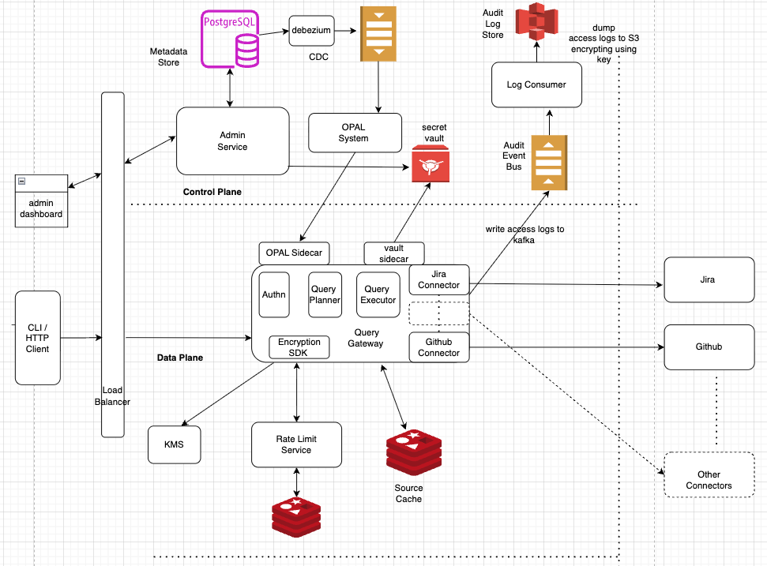

# Universal SQL Gateway

Cross-app federated SQL query layer for enterprise SaaS applications. Users write a single SQL SELECT — the system handles federation across SaaS APIs, entitlement enforcement (RLS/CLS), rate-limit compliance, and freshness control transparently.

**Prototype scenario**: GitHub Pull Requests ↔ Jira Issues — cross-app JOIN with entitlements, rate limiting, and cache-aware freshness.

## Architecture



---

## Key Trade-offs

> These trade-offs assume the end-to-end production design described in the deep-dive docs below and the [six-month execution plan](docs/EXECUTION_PLAN.md). The prototype demonstrates the core query path; the trade-offs below reflect the design decisions that would govern the system at scale.

### 1. Tenant-Scoped Fetch Cache + Post-Fetch RLS — vs Per-User Cache
Cache is keyed on `(tenant, connector, table, pushed_filters)`, not per-user. The cache intentionally holds data individual users may not see — RLS/CLS filters are applied locally on read, same model as Postgres RLS. **Give**: cache stores rows the requesting user might not be authorized for. **Get**: 1 cache entry serves 10K users → ~70-80% hit rate instead of ~5%, avoids rate-limit exhaustion, and avoids key-space explosion — a per-user or per-query cache would produce O(users × queries) keys, making eviction, memory sizing, and invalidation unmanageable at 10M users. See [freshness-and-caching.md](docs/data-plane/freshness-and-caching.md).

### 2. In-Process Connectors + Bulkhead Isolation — vs Out-of-Process Microservices
Connectors run in the same Go binary with goroutine pools, memory budgets, circuit breakers, and panic recovery. **Give**: a misbehaving connector can theoretically affect the process (mitigated by bulkheads). **Get**: eliminates ~80ms serialization overhead per join leg (16% of 500ms P50 budget). Every production federated engine (Trino, Presto, DuckDB) runs connectors in-process. Out-of-process justified only for untrusted code or different language runtimes. See [data-plane.md §2](docs/data-plane/data-plane.md).

### 3. Freshness Floor + Live-Fetch Budget + Graceful Degradation — vs Honoring max_staleness=0
`max_staleness=0` is clamped to a per-connector floor (e.g., 30s). Live fetches are gated by a per-tenant token bucket. When budget is exhausted, stale cache is served with `CACHE_FORCED` transparency — not an error. **Give**: clients cannot guarantee perfectly fresh data. **Get**: one tenant's freshness demand cannot burn rate-limit budget for all tenants sharing the same OAuth token. See [freshness-and-caching.md §5](docs/data-plane/freshness-and-caching.md).

### 4. Federated On-The-Fly Join + Size-Triggered S3 Materialization — vs Always-Materialize / Frequency-Based

Default is in-memory hash join (build on smaller side); DuckDB handles spill-to-disk when memory budget is exceeded. Join results are written to S3 as encrypted Parquet **only when the serialized result exceeds ~1 MB**.

**Why not always write joins to S3?** Source-level results are already cached in Redis. Once both sides are warm, the in-memory hash join on typical result sets (e.g. 200 × 2 000 rows → 800 matches) completes in <10 ms. Writing that to S3 would add ~20-50 ms PUT latency plus encryption and compliance overhead — slower than just recomputing next time.

| | Always-materialize to S3 | Size-triggered (chosen) | Frequency-based |
|---|---|---|---|
| **Small joins (<1 MB)** | Unnecessary S3 PUT + compliance surface | Recompute in <10 ms from source cache | Recompute until frequency threshold hit, then materialize |
| **Large joins (>1 MB)** | Cached; S3 GET ~20-50 ms | Same — materialized on first occurrence | Recompute N times before materializing |
| **Infra complexity** | S3 lifecycle + encryption for every join | S3 lifecycle only for large results | + frequency counters, threshold tuning, race conditions |
| **Compliance surface** | Every join result is a stored artifact | Only large results stored (short TTL, crypto-shred) | Same as always-materialize once threshold is crossed |
| **Cold-start penalty** | None (always cached) | Recompute once per large join | Recompute N times for large joins |

**Give**: repeated small-to-medium joins recompute each time (source cache makes this near-free). **Get**: no counter infrastructure, no threshold tuning, and zero compliance surface for the common case. See [freshness-and-caching.md §Materialization](docs/data-plane/freshness-and-caching.md).

### 5. OPAL Push for Policy Revocation — vs TTL-Only Propagation
Security-critical changes (entitlement revocation, tenant off-boarding) propagate via OPAL push in ~1-2s. Low-severity changes (new connectors, schema updates) use 30-60s TTL pull. **Give**: OPAL server, sidecar per pod, event bus dependency — real operational complexity. **Get**: revoked user's query window shrinks from 60s to ~1-2s. Most systems accept the TTL window; we chose not to for enterprises with strict revocation SLAs. See [control-plane.md §3.2](docs/control-plane/control-plane.md).

---

## Docs

### Start here
| Doc | What it covers |
|---|---|
| [EXECUTION_PLAN.md](docs/EXECUTION_PLAN.md) | Six-month roadmap — team shape, milestones, acceptance criteria, risk register |

### Data Plane
| Doc | What it covers |
|---|---|
| [data-plane.md](docs/data-plane/data-plane.md) | Component map, planner internals, sync/async paths, end-to-end query trace |
| **[freshness-and-caching.md](docs/data-plane/freshness-and-caching.md)** | **The hardest design surface** — predicate pushdown decisions, tenant-scoped fetch cache, TTL + ETag/conditional fetch, materialization triggers, staleness contracts |
| [rate-limit-service.md](docs/data-plane/rate-limit-service.md) | Token bucket design, per-tenant/connector/user fairness, async overflow path |
| [connector.md](docs/data-plane/connector.md) | Connector SDK interface, runtime isolation, bulkhead patterns, auth/token refresh |
| [executor.md](docs/data-plane/executor.md) | Entitlement enforcement (OPA/OPAL), RLS/CLS application, join execution, spill strategy |

### Control Plane
| Doc | What it covers |
|---|---|
| [control-plane.md](docs/control-plane/control-plane.md) | Tenant/connector registry, schema catalog, policy propagation (OPAL push vs TTL pull), Postgres schema |

### Security & Compliance
| Doc | What it covers |
|---|---|
| [security-design-notes.md](docs/security/security-design-notes.md) | STRIDE threat model, mTLS, per-tenant KMS, audit pipeline, crypto-shredding, data residency |

### Scale & Operations
| Doc | What it covers |
|---|---|
| [capacity-and-performance.md](docs/scaling/capacity-and-performance.md) | Autoscaling policies, overload protection, backpressure, load test plan |
| [deployment-strategy.md](docs/deployment-strategy.md) | Terraform modules, Helm/k8s, canary/blue-green, multi-tenant vs single-tenant deployment |

---

## Quickstart

### Prerequisites
- **Docker route**: Docker & Docker Compose only
- **CLI route**: Go 1.24+

---

### Option A: Docker (UI + full observability stack)

```bash
cd deployment/docker
docker-compose up --build
```

| Service | URL |
|---|---|
| Query UI | http://localhost:8080 |
| Jaeger traces | http://localhost:16686 |
| Prometheus metrics | http://localhost:9090 |

Open http://localhost:8080 and click any scenario button (Cross-app JOIN, RLS, CLS, Cache hit, Rate limit burst, etc.) to run a pre-wired demo query.

---

### Option B: CLI (local Go run)

**1. Generate tokens**
```bash
# admin (sees all rows)
JWT_SECRET=dev-secret go run cmd/token-gen/main.go -sub u-1 -tenant t-1 -username alice -email alice@acme.dev -roles admin -expiry 87600h

# developer (RLS: own rows only)
JWT_SECRET=dev-secret go run cmd/token-gen/main.go -sub u-2 -tenant t-1 -username bob -email bob@acme.dev -roles developer -expiry 87600h

# viewer (CLS: email masked)
JWT_SECRET=dev-secret go run cmd/token-gen/main.go -sub u-3 -tenant t-1 -username charlie -email charlie@acme.dev -roles viewer -expiry 87600h
```

**2. Start the gateway**
```bash
JWT_SECRET=dev-secret POLICY_PATH=configs/policy.yaml go run cmd/query-gateway/main.go
```

**3. Run a query**
```bash
curl -s -X POST http://localhost:8080/v1/query \
  -H "Authorization: Bearer <token>" \
  -H "Content-Type: application/json" \
  -d '{
    "sql": "SELECT pr.title, pr.author, i.summary FROM github.pull_requests pr JOIN jira.issues i ON pr.pr_number = i.pr_number WHERE pr.state = '\''open'\''",
    "max_staleness_ms": 30000
  }' | jq .
```

Response includes `rows`, `columns`, `freshness_ms`, `cache_hit`, `rate_limit_status`, and `trace_id`.

---

### Load test

No extra tools needed — runs with the Go toolchain already required for the project.

```bash
go run tests/load/main.go
```

Optional flags:

```bash
go run tests/load/main.go -url http://localhost:8080 -duration 60s -max-vus 500 -start-vus 25
```

Tokens (admin / developer / viewer) are generated inside the script using the same `JWT_SECRET` env var as the gateway (defaults to `dev-secret`). Ramps from 25 → 500 VUs over 60s, then reports P50/P95/P99 latency, QPS, cache-hit rate, and rate-limit hits. Exits non-zero if P95 > 1500ms or error rate > 1%.

---

### Observability

**Traces** — Open [Jaeger UI](http://localhost:16686), select service `query-gateway`. Each trace shows the full query path: parse → plan → concurrent connector fetches → join → RLS/CLS → response.

**Metrics** — Open [Prometheus UI](http://localhost:9090/graph) and paste any of these (run a few demo queries from the UI first):

| What | PromQL |
|---|---|
| Requests by status (200/429) | `query_gateway_requests_total{path="/v1/query"}` |
| Latency histogram | `query_gateway_request_duration_seconds_bucket{path="/v1/query"}` |
